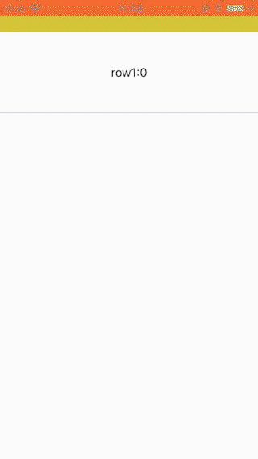
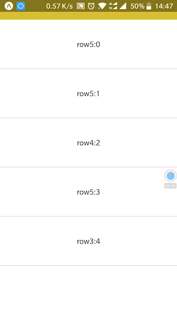

# react-native-ptr-control
React-native pull to refresh and pull-up load more component, supported custom refresh and load more component

Supported Scroll Component is:

* **ScrollView**
* **ListView**
* **FlatList**
* **VirtualizedList**

Supported React-Native Version is **>= 0.43.0**, because this lib supported FlatList
## example
example is in the folder of example, the app.js is the entrance, example run in environment:
* expo: 23
* react-native: 0.50.0
* react: 16.0.0

 
### run example
**Suggest: run example in real device, the performance will perfect**

* `cd example`

* `yarn install`

* `yarn start`

and then take your iphone or android device, use the **_Expo_** app scan the QRCode, and have fun

**Be careful:**
* if can not load project, see the detail, sometimes it cost long time to load, and sometimes, the **_Expo_** version
is incorrect
* checkout the network, whether is your device and your computer in the same network segment
## Installation
`$ npm install react-native-ptr-control --save`
## Usage
here is a simple usage of this lib, see example folder and find app.js for full usage

**_Note: when use react-native-ptr-control, use it as usual, for example, if scrollComponent is 'ScrollView', pass ScrollView`s 
props and props of lib provide, such as:_**

* ScrollView

        import React, {Component} from 'react'
        import {View, Text} from 'react-native'
        import PTRControl from 'react-native-ptr-control'
        export default class MyScrollComponent extends Component {
          render () {
            return (
              <PTRControl
                //here is the origin props of ScrollView
                style={{flex: 1}}
                showsVerticalScrollIndicator={false}
                //here is the props of lib provide
                scrollComponent={'ScrollView'}
                enableFooterInfinite={false}>
                <View>
                  <Text>{'scroll content'}</Text>
                </View>
              </PTRControl>
              )
          }
        }
* ListView

        import React, {Component} from 'react'
        import {View, Text} from 'react-native'
        import PTRControl from 'react-native-ptr-control'
        export default class MyScrollComponent extends Component {
          render () {
            return (
              <PTRControl
                //here is the origin props of ListView
                dataSource={this.state.dataSource}
                renderRow={this.renderRow}
                showsVerticalScrollIndicator={false}
                //here is the props of lib provide
                scrollComponent={'ListView'}
                />
              )
          }
        }
    
## Properties
**_Note: list of below props is extends props, the origin props of scroll component (for example: ScrollView) 
should also be passed_**

| Prop | Description | Type | Default | Platform | isRequired |
|---|---|---|---|---|---|
| *scrollComponent* | mark the scroll component, can be 'ScrollView', 'ListView', 'FlatList', 'VirtualizedList' | *string* | 'FlatList' | all | yes |
| *getRef* | get the scroll component`s ref | *func* | _None_ | all | no |
| *enableHeaderRefresh* | whether to enable header refresh | *bool* | true | all | no |
| *setHeaderHeight* | if header refresh is set, this prop mark the header height, if header refresh is set, **this prop should be set** | *number* | 60 | _Android_ | no |
| *onTopReachedThreshold* | threshold to trigger refresh | *number* | 10 | _Android_ | no |
| *renderHeaderRefresh* | render the custom component of refresh header, and the *gestureStatus* and *offset* will be passed, see example for detail | *func* | default function | all | no |
| *onHeaderRefreshing* | when release to refresh, this fun will be called, see example for detail | *func* | default function | all | no |
| *pullFriction* | when scroll component is not full of children, pull to refresh is controlled by gesture, and this prop controls how fast to pull down, **range: 0 ~ 1** | *number* | 0.6 | _Android_ | no |
| *enableFooterInfinite* | whether to enable footer load-more | *bool* | true | all | no |
| *setFooterHeight* | if footer load-more is set, this prop mark the footer height, if footer load-more is set, **this prop should be set** | *number* | 60 | _Android_ | no |
| *onEndReachedThreshold* | threshold to trigger load-more | *number* | 10 | _Android_ | no |
| *renderFooterInfinite* | render the custom component of load-more, and the *gestureStatus* and *offset* will be passed, see example for detail | *func* | default function | all | no |
| *onFooterInfiniting* | when release to load-more, this fun will be called, see example for detail | *func* | default function | all | no |

#### onHeaderRefreshing and onFooterInfiniting
this props should be passed a function, and *gestureStatus* and *offset* will be the params, something like that

`onHeaderRefreshing = {(gestureStatus, offset) => <HeaderRefresh gestureStatus={gestureStatus} offset={offset/>}`

`onFooterInfiniting = {(gestureStatus, offset) => <FooterInfinite gestureStatus={gestureStatus} offset={offset/>}`
#### gestureStatus
* 0: gesture none
* 1: pull-up to load-more
* 2: pull-down to refresh
* 3: release to refresh or load-more
* 4: on header refreshing
* 5: on footer loading-more
#### offset
* when pull-down to refresh or pull-up to load-more, this offset params represent the pull distance 
## static methods
**_Important: when header refresh done, or footer load-more done, should call this static method_**
* **headerRefreshDone** `PTRControl.headerRefreshDone()`

  after onHeaderRefreshing, when refresh done, and the data load complete, call this method to stop refresh
  
* **footerInfiniteDone** `PTRControl.footerInfiniteDone()`

  after onFooterInfiniting, when load-more done, and the data load complete, call this method to stop load-more